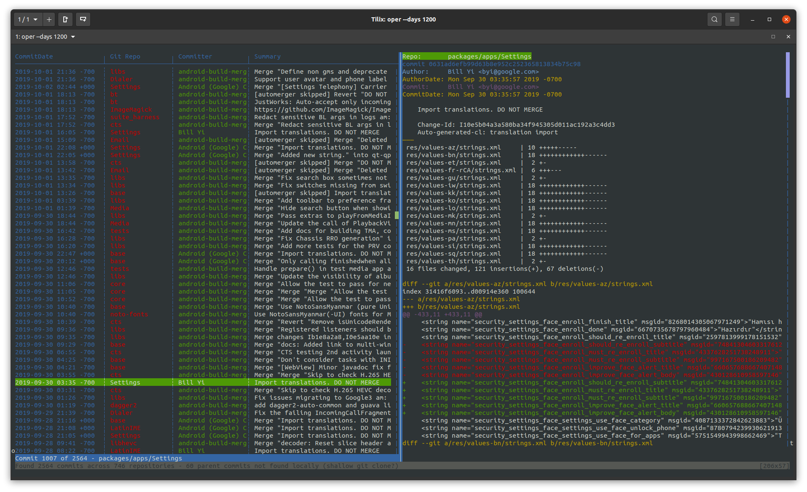

# Scope
Oper is a basic history tool for git repositories managed by google's [git-repo tool](https://source.android.com/setup/develop/repo).

It can show the history of the last _n_ days across all managed git repositories.

Oper is inspired by [tig](https://jonas.github.io/tig/), but is far for more basic. Don't expect any commands or additional views.



# Installation

Oper is written in rust. You need the rust toolchain installed to be able to use it:

https://www.rust-lang.org/tools/install

Then you simply install _oper_ with:

```
cargo install oper
```

# Usage

- Define the number of days to include in the history with the _--days_ cli switch
- Filter commits by using the _--author_ or _--message_ cli switches
- Quit oper by pressing _q_
